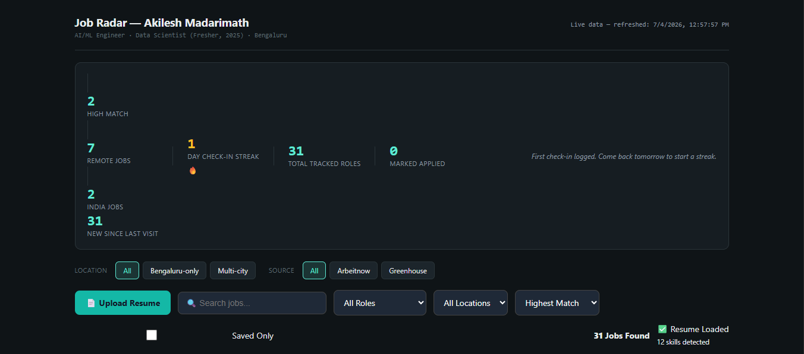
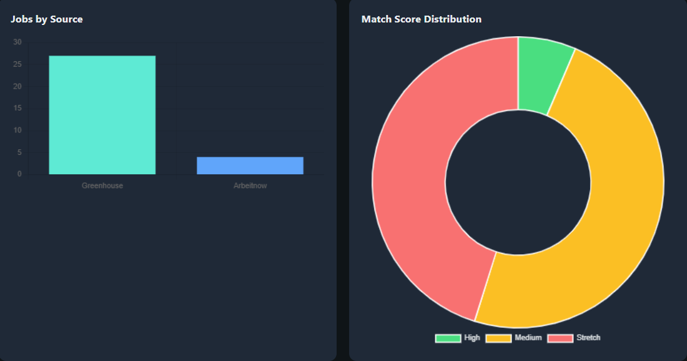

# 🚀 Job Radar

An AI-powered Job Search Dashboard that aggregates jobs from multiple sources and helps users find the best opportunities using resume-based matching.

## ✨ Features

- 📄 Resume Upload (PDF)
- 🤖 Resume Skill Extraction
- 🎯 Dynamic Match Score
- 🔍 Search Jobs
- 📍 Filter by Location
- 💼 Filter by Role
- ❤️ Save Jobs
- 📊 Analytics Dashboard
- 📄 Cover Letter Generator
- ⬇ Download Cover Letter PDF

---

## 🛠 Technologies Used

- HTML5
- CSS3
- JavaScript
- Python
- Chart.js
- PDF.js
- jsPDF

---

## 📸 Screenshots

### Dashboard



### Analytics



### Resume Upload


### Cover Letter


---

## ▶️ Run Locally

```bash
pip install -r requirements.txt

python job_radar_scraper.py
```

Then open:

```text
index.html
```

---

## 👨‍💻 Author

**Akilesh Madarimath**